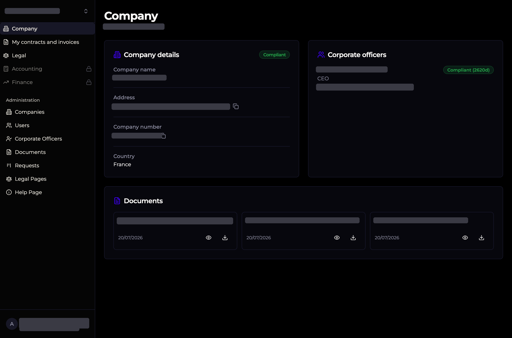
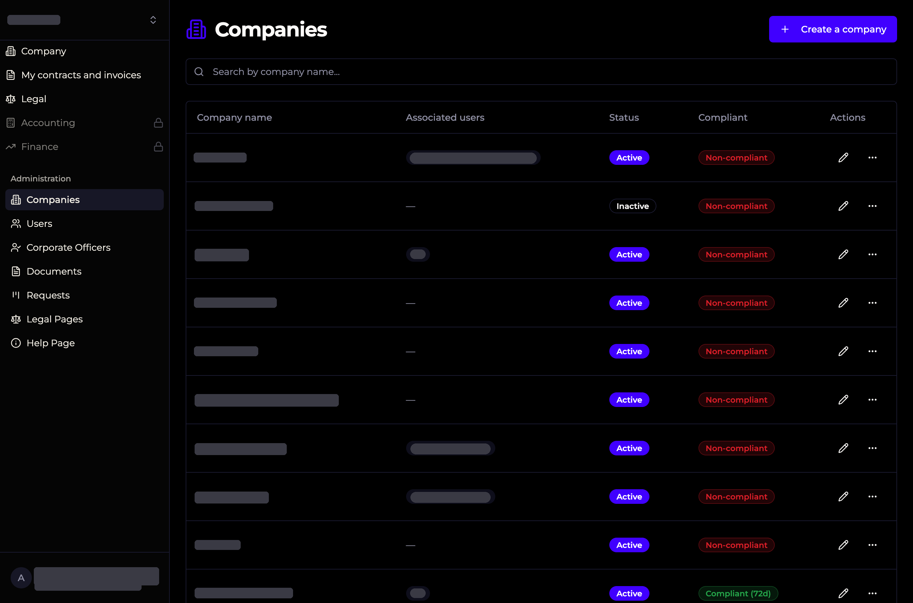

# Ignizis — Multi-Company Document & Compliance Platform

A secure, web-based platform designed for companies, fiduciaries, and corporate service providers to centralize document management, track compliance, and manage client requests across multiple entities.

> **Live demo:** [https://app.ignizis.com](https://app.ignizis.com)

---

## Screenshots

<!-- Add your screenshots below. Recommended: 1200x800, drop them in the repo or use image URLs. -->

| Dashboard | Document Management | Request Board |
|-----------|-------------------|---------------|
|  |  |  |

| Admin — Companies | Admin — Legal Pages | Help Center |
|-------------------|---------------------|-------------|
|  |  |  |

---

## Features

- **Multi-company workspace** — Switch between companies from a single account. Each user sees only the companies and sections they are authorized to access.
- **Document management** — Upload, categorize, tag, and download contracts, invoices, legal documents, passports, and powers of attorney. Fine-grained links between documents and companies or corporate officers.
- **Compliance tracking** — Monitor corporate officer compliance (passport, ID, power of attorney) with expiration alerts and validation workflows.
- **Request board (Kanban)** — Create and track client requests through a visual pipeline: new request → quote pending → in progress → awaiting client response → invoiced → done.
- **Dynamic content pages** — Administrators can edit legal pages (legal notice, privacy policy, terms of use) and the help center through a rich-text editor (Tiptap). Content is served from the database and rendered as safe HTML.
- **Magic-link authentication** — Passwordless sign-in via secure email links. No passwords to manage or leak.
- **Role-based access** — Differentiated navigation and permissions for regular users and administrators.
- **Responsive design** — Fully functional on desktop, tablet, and mobile.
- **Dark mode support** — System-aware and manual theme toggle.

---

## Tech Stack

| Layer | Technology |
|-------|------------|
| Frontend | [React 18](https://react.dev/), [TypeScript](https://www.typescriptlang.org/), [Vite](https://vitejs.dev/) |
| Styling | [Tailwind CSS v3](https://tailwindcss.com/), [shadcn/ui](https://ui.shadcn.com/) |
| Backend & Auth | [Supabase](https://supabase.com/) — Postgres, Auth, Storage, Edge Functions |
| Rich Text | [Tiptap](https://tiptap.dev/) |
| i18n | Custom React context with JSON locale files |
| Testing | [Vitest](https://vitest.dev/) |

---

## Getting started with

This project was initialized using [Lovable](https://lovable.dev).

### Prerequisites

- Node.js ≥ 18
- npm or bun

### Install dependencies

```bash
npm install
```

### Run the development server

```bash
npm run dev
```

The dev server will start at `http://localhost:5173` (or the next available port).

---

## Environment Variables

Create a `.env` file at the project root with the following variables:

```bash
VITE_SUPABASE_URL=your_supabase_project_url
VITE_SUPABASE_ANON_KEY=your_supabase_anon_key
```

> The Supabase client is auto-generated at `src/integrations/supabase/client.ts` and should not be edited manually.

---

## Database Migrations

Migrations are stored in `supabase/migrations/` and applied through the Supabase CLI or Lovable Cloud backend interface.

---

## Edge Functions

Serverless functions located in `supabase/functions/`:

- `send-magic-link` — Sends authentication emails.
- `notify-new-request` — Notifies administrators when a new client request is created.
- `retry-failed-notifications` — Retries failed notification deliveries.
- `check-user-exists` — Checks user existence during onboarding flows.
- `auto-login` — Automated login helpers for testing or internal tools.
- `admin-users` — Admin-level user management utilities.

Deploy all functions:

```bash
npx supabase functions deploy
```

---

## Build for production

```bash
npm run build
```

The production bundle is output to `dist/`.

---

## License

<!-- Add your license here, e.g. MIT, Proprietary, etc. -->
